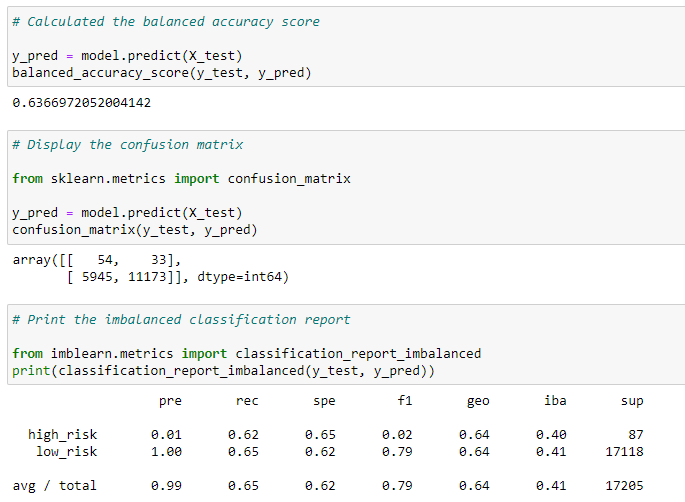
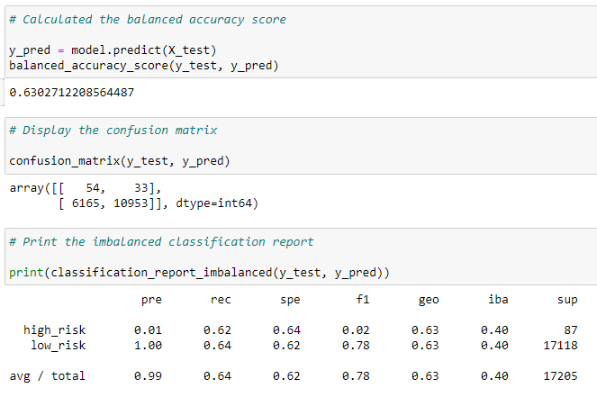
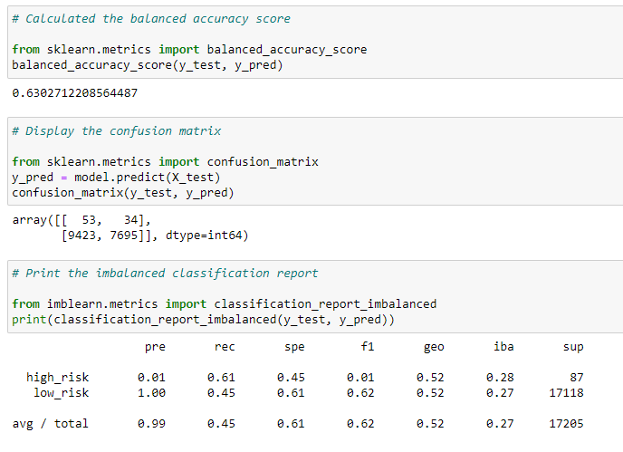
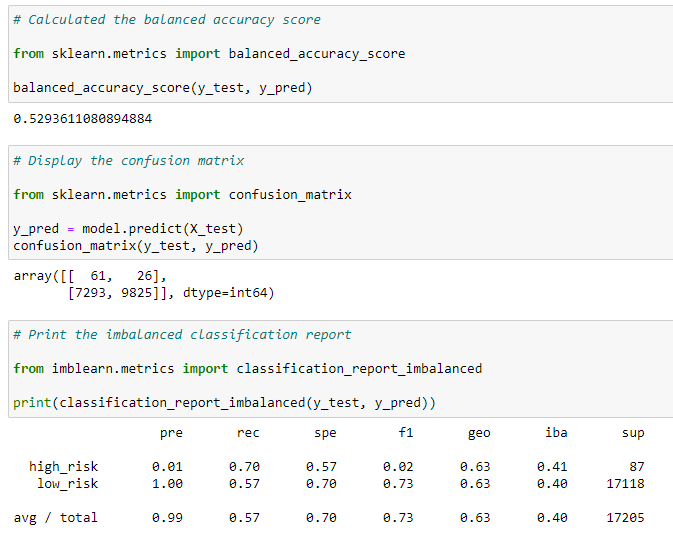
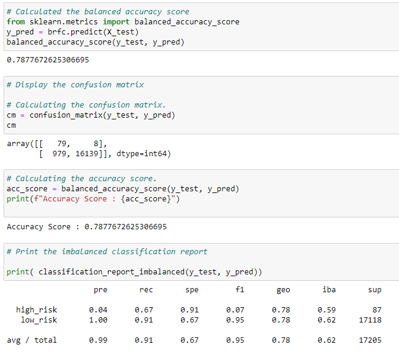
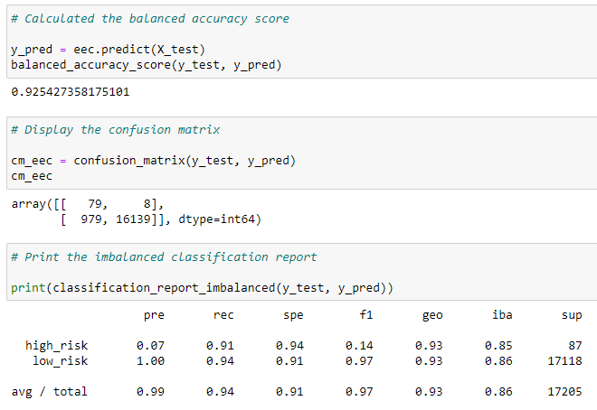

# Credit_Risk_Analysis

## Overview
Machine learning principles for over and under sampling were used to train and evaluate models  with unbalanced classes to predict credit risk for loan approval. 

## Tools
Use imbalanced-learn and scikit-learn libraries to build and evaluate models using resampling.
Use oversampling algorithms RandomOverSampler and SMOTE, undersampling algorithm ClusterCentroids, combinatorial over- and undersampling using the SMOTEENN algorithm to evaluate model performance.
compare two new machine learning models that reduce bias, BalancedRandomForestClassifier and EasyEnsembleClassifier, to predict credit risk.

## Results: 
### Oversampling
#### RandomOverSampler
* balanced accuracy scores: 64%
* precision scores: 99%
* recall scores: 65%

#### SMOTE
* balanced accuracy scores: 63%
* precision scores: 99%
* recall scores: 64%

### Undersampling
#### ClusterCentroids
* balanced accuracy scores: 63%
* precision scores: 99%
* recall scores: 45%

### Combinatorial over- and undersampling
#### SMOTEENN
* balanced accuracy scores: 53%
* precision scores: 99%
* recall scores: 57%

### Reduce bias
#### BalancedRandomForestClassifier
a.	balanced accuracy scores: 79%
b.	precision scores: 99%
c.	recall scores: 91%

#### EasyEnsembleClassifier
a.	balanced accuracy scores: 93%
b.	precision scores: 99%
c.	recall scores: 94%

## Summary:
* Reduced bias models showed better performance overall 
* Recomeded model: EasyEnsembleClassifier
